## Sommaire

1. [Utilisation de base](#utilisation-de-base)
      * [nmap](#nmap)
      * [zenmap](#zenmap)
      * [netcat](#netcat)
2. [Utilisation avancée](#utilisation-avancee)
      * [nmap avancé](#nmap-avance)
      * [netcat avancé](#netcat-avance)
3. [Pour les pros](#pour-les-pros)
      * [Metasploit](#metasploit)

# 1. Utilisation de base

## nmap

## Commande essentiel :

| Commande             | Explication                                                 | Exemple                     | 
| -------------------- | ----------------------------------------------------------- | --------------------------- |
| `nmap <IP>`          | Scan basique (TCP connect) des 1000 ports les plus courants | `nmap 192.168.1.1`          |
| `nmap -p 1-100 <IP>` | Scanne les ports 1 à 100                                    | `nmap -p 1-100 192.168.1.1` |
| `nmap -p- <IP>`      | Tous les ports (1 à 65535) – lent mais complet              | `nmap -p- 192.168.1.1`      |
| `nmap -sS <IP>`      | SYN scan (plus rapide, furtif, nécessite root)              | `sudo nmap -sS 192.168.1.1` |
| `nmap -sV <IP>`      | Détecte version des services (ex: Apache 2.4.41)            | `nmap -sV 192.168.1.1`      |

## Utilisation :

### Commande nmap (IP cible)

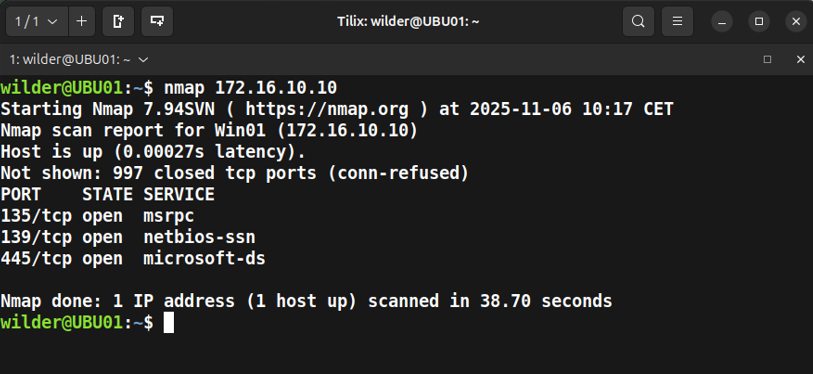

* Avec cette commande vous lancerez un scan des 1000 ports les plus courants, des informations apparaîtrons :

* Le nom de la machine cible (Nom + IP)
  
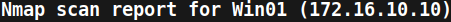

* Les informations sur les 1000 ports :

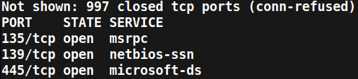

* Vous comprendrez alors que sur les 1000 ports 997 sont fermés et que 3 sont ouverts.

### Commande nmap (IP machine) /24

| 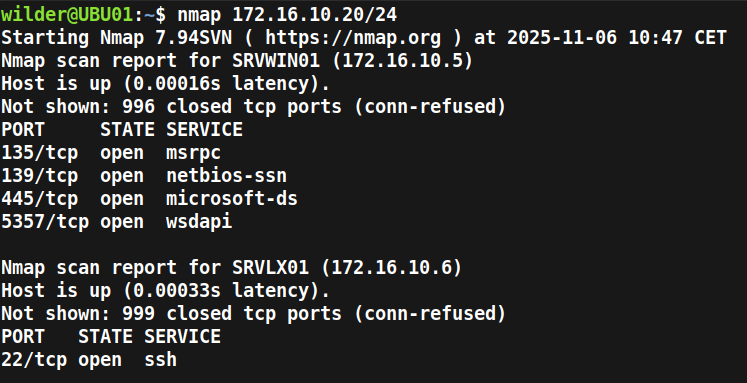 | 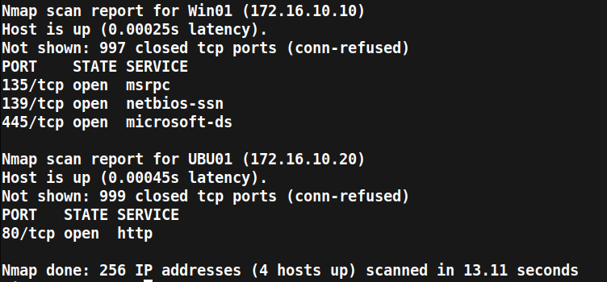 |
| ------------------------------------------------------ | ---------------------------------------------------------- |

* Avec cette commande vous lancerez un balayage du réseau pour savoir quelles machines (actives) sont connectées au réseau, ainsi que les ports ouverts sur les différentes machines.

| Élément               | Signification                 | Détail                                                                                           |
| --------------------- | ----------------------------- | ------------------------------------------------------------------------------------------------ |
|   `nmap`              | Nom du programme              | Outil de scan réseau                                                                             |
|   `172.16.10.20/24`   | Plage d’adresses IP à scanner | C’est tout le réseau local :     de `172.16.10.0` à  `172.16.10.255`     → 256 adresses.         |
|   `/24`               | Notation CIDR*                | Signifie : les 24 premiers bits de l’IP sont fixes → les 8 derniers bits varient (2⁸ = 256 IPs). |

* Le CIDR permet aux routeurs d'organiser plus efficacement les adresses IP en plusieurs sous-réseaux.

### Les options :

| Option     | Rôle                                                | Exemple                                   |
| ---------- | --------------------------------------------------- | ----------------------------------------- |
| `-p`       | Spécifie les ports                                  | `-p 22,80,443` ou `-p 1-1000`             |
| `-sS`      | SYN scan (rapide, furtif) → root requis             | `sudo nmap -sS 192.168.1.1`               |
| `-sT`      | TCP connect scan (sans root)                        | `nmap -sT 192.168.1.1`                    |
| `-sU`      | Scan UDP (lent, mais utile)                         | `sudo nmap -sU -p 53,123,161 192.168.1.1` |
| `-sV`      | Détection de version                                | `nmap -sV 192.168.1.1`                    |
| `-O`       | Détection d’OS (doit être root)                     | `sudo nmap -O 192.168.1.1`                |
| `-A`       | Scan agressif : version + OS + scripts + traceroute | `sudo nmap -A 192.168.1.1`                |
| `--reason` | Montre pourquoi un port est ouvert/fermé            | `nmap --reason 192.168.1.1`               |
| `-v`       | Mode verbeux (plus d’infos)                         | `nmap -v 192.168.1.1`                     |
| `-vv`      | Très verbeux                                        |                                           |

## zenmap

Le logiciel zenmap a la même utilité que le nmap, à la différence qu'il propose un service graphique.  
Par exemple :

| 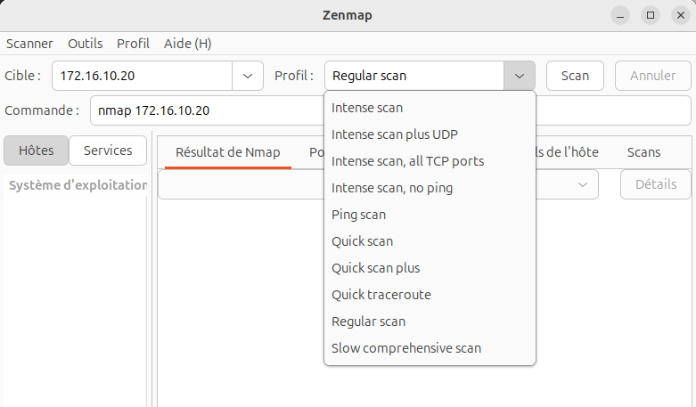 |
| ---------------------------------------- |
* Commande classique comme avec nmap, vous pouvez cependant taper l'IP dans CIBLE et chosir le type de scan que vous voulez faire. La commande s'écrira toute seule.

| 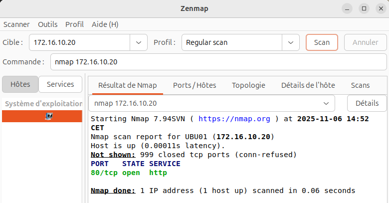 |
| ---------------------------------------- |
* Vous aurez ensuite le résultat du scan qui apparaîtra.

| 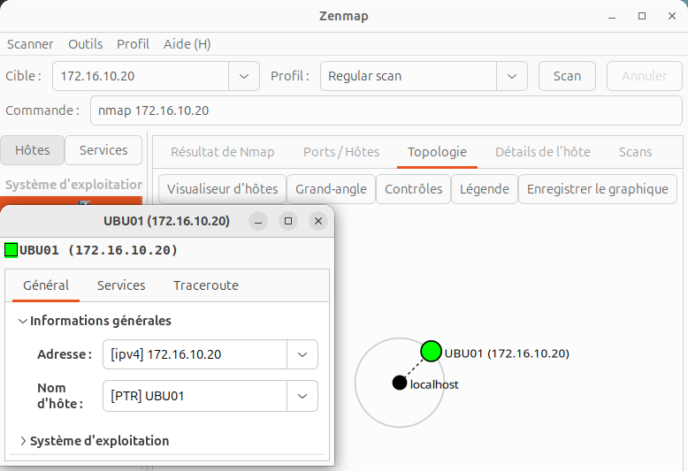 |
| ---------------------------------------- |
* Vous aurez aussi la possibilité d'afficher la topologie du réseau (il n'est pas très grand). Ainsi que bien d'autres informations avec les outils qui vous sont proposés.

## Audit complet du réseau avec Zenmap
Il est possible d'utiliser un **"slow comprehensive scan"** via Zenmap.
Cette commande est à utiliser avec Zenmap pour plus de praticité. Le scan peut durer plusieurs dizaines de minutes.

`nmap -sS -sU -T4 -A -v -PE -PP -PS80,443 -PA3389 -PU40125 -PY -g 53 --script "default or (discovery and safe)" 172.16.10.10/24`

Voici la description des options présentes :

| Options    | Description                                                                                                                                                                                                                                                                                                                                                                                                                                                                    |
| ---------- | ------------------------------------------------------------------------------------------------------------------------------------------------------------------------------------------------------------------------------------------------------------------------------------------------------------------------------------------------------------------------------------------------------------------------------------------------------------------------------ |
| `-sS`      |SYN scan (rapide, furtif) → root requis"                                                                                                                                                                                                                                                                                                                                                                                                                                                   |
| `-sU`      | Lance un scan des ports UDP                                                                                                                                                                                                                                                                                                                                                                                                                                                    |
| `-T4`      | Modèle de timing agressif. Rapide mais détectable. Ne dépasse pas 10 ms par port TCP                                                                                                                                                                                                                                                                                                                                                                                           |
| `-A`       | Active plusieurs options de détection comme `-O` pour l'OS, et`-sV` pour détection des versions de service et traceroute                                                                                                                                                                                                                                                                                                                                                                    |
| `-v`       | Active le mode " verbeux " qui affiche des informations détaillés pendant le scan.                                                                                                                                                                                                                                                                                                                                                                                             |
| `-P..`     | Envoi des paquets vers des ports spécifiques                                                                                                                                                                                                                                                                                                                                                                                                                                   |
| `-g 53`    | Force Nmap à utiliser le port source 53 (port DNS). Certains pare-feu mal configurés font confiance aux paquets provenant du port 53, pensant qu'ils viennent de requêtes DNS légitimes.                                                                                                                                                                                                                                                                                      |
| `-PY`      | Envoie des paquets SCTP (Stream Control Transmission Protocol) pour la découverte d'hôte. Moins courant que TCP/UDP, mais utile dans certains environnements spécialisés.                                                                                                                                                                                                                                                                                                      |
| `--script` | **`default`** : scripts de reconnaissance générale considérés comme sûrs et utiles **`discovery`** : scripts spécialisés dans la découverte de services et d'informations réseau **`safe`** : scripts **non-intrusifs** qui ne risquent pas de planter des services ou d'endommager les systèmes  Cette combinaison `default or (discovery and safe)` signifie : exécuter tous les scripts "default" OU tous les scripts qui sont à la fois "discovery" ET "safe". |

On obtient ainsi la liste complète des hôtes actifs sur le segment scanné, même ceux qui ne répondent pas aux pings classiques grâce à la combinaison de techniques de découverte.

Les informations receuillies sont filtrables dans Zenmap selon l'hôte scanné ou les srevices découvert (affiche les ports correspondant)  :

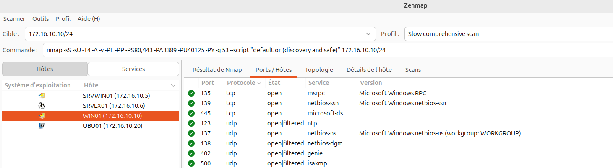

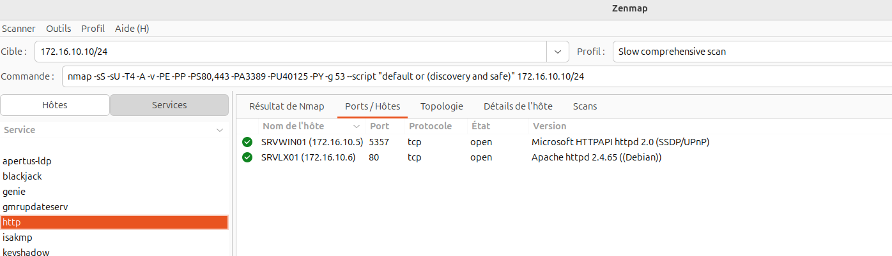

Dans l'onglet resultats, il est alors possible de détecter des failles techniques (versions vulnérables, ou non mises à jour, services mal configurés, ports ouverts inutiles).

Si l'on s'intéresse à notre machine sous Windows (172.16.10.10) On peut remarquer les riques suivant :

* Le port 135 est ouvert.
> Le port 135 est historiquement une cible privilégiée pour les attaques, notamment en raison de vulnérabilités passées comme celles exploitées par le ver Blaster ou le ransomware WannaCry, qui ont utilisé des failles pour se propager à grande échelle.  Bien qu'il soit nécessaire pour faciliter les communications à distance entre applications et services, l'ouverture du port 135 sur le réseau expose le système à des risques de sécurité significatifs.

* De nombreux ports UDP sont ouverts avec des services inconnus

|                                                    |                                                    |
| -------------------------------------------------- | -------------------------------------------------- |
| 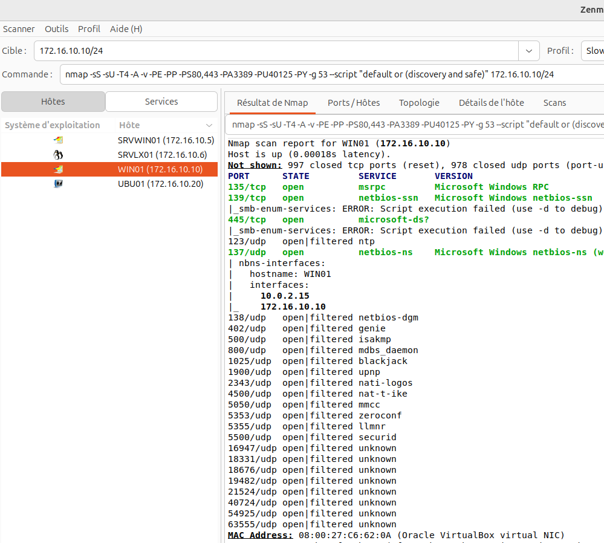 | 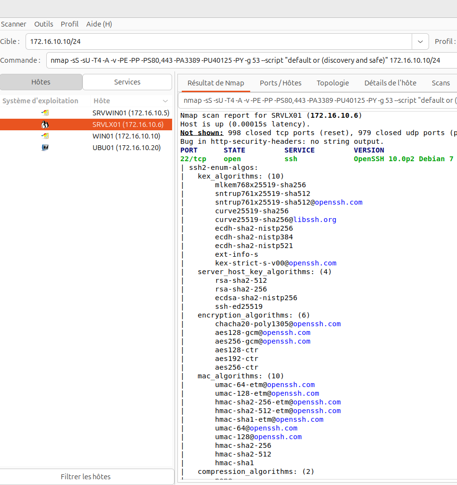 |

Si l'on s'intéresse à notre machine sous Debian (172.16.10.6)

* Un serveur SSH (port 22) est ouvert et non filtré par un parefeu. On remarque aussi que des algorithmes de securité sont identifiés comme vulnérables.

>Il s'agit ici de l'algorithme HMAC-SHA1. SHA-1 est considéré comme affaibli. Il faudrait restreindre la négociation aux seuls algorithmes avec SHA-2 et désactiver le support SHA-1.

## netcat

## Communiquer du texte entre deux machines
Dans cet exemple la première machine client (en écoute) est sur Ubuntu. Tapez la commande :

`nc -l -p 1234`

La machine Ubuntu va écouter sur le port 1234

Sur la deuxième machine sous Windows, tapez la commande :

`ncat 176.16.10.XXX 1234`

La machine va se connecter sur le port 1234 de la machine en écoute dont l'adresse IP est 176.16.10.XXX

Il est alors possible possible de "chatter" via le terminal.

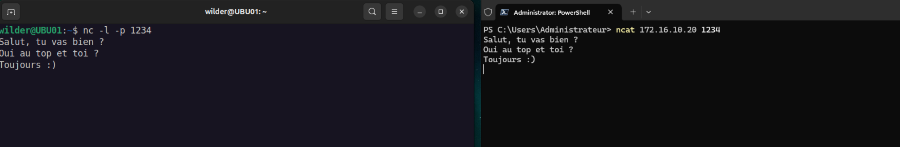

## Vérifier si un port est ouvert

La commande suivante va permettre de scanner une machine en spécifiant le port à vérifier :

`ncat -zv  176.16.10.XXX 22`

ici le port à vérifier est le 22 (service SSH).  
l'option `-z` active le mode scan et ne transmet pas de données.  
l'option `-v` pour verbeux, affiche des détails

Pour scanner une plage de port sur une plage définie :

`nc -zv 176.16.10.XXX 1-140`

ici le scan va s'éffectuer sur les ports 1 à 140.
Un message affichera la reussite si un port est ouvert.

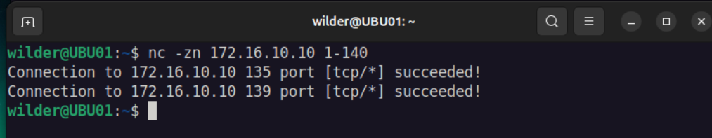

## Transfert de fichier entre deux machines

### Sur la machine qui émet :

|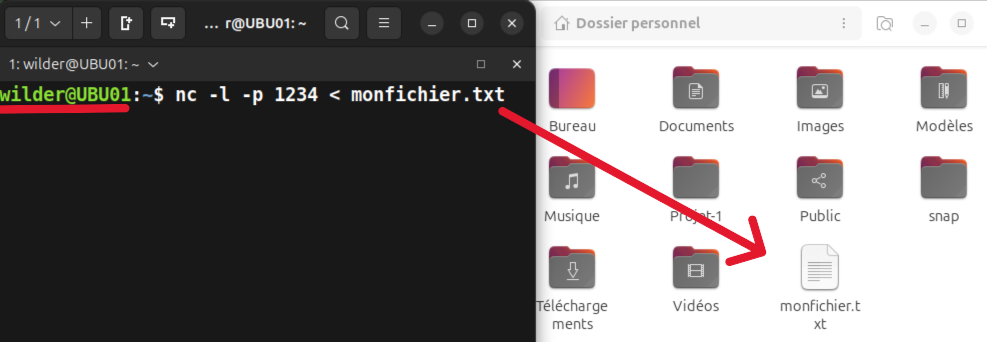|
| ------------------------------------------------------ |

* La commande `nc -l -p 1234 < fichier_a_envoyer.txt` envoie le fichier choisi dans le port nouvellement ouvert.

|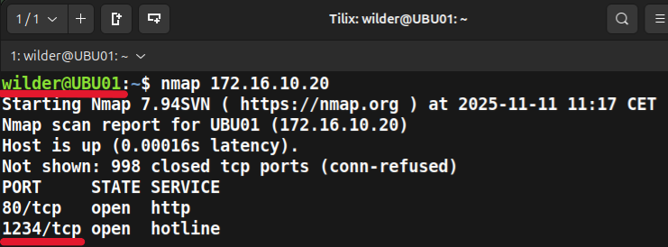|
| ---------------------------------------------------------- |

* Vous pouvez constater que le port est bien ouvert avec la commande `nmap (IP)`.
* La connexion peut être établie.

### Sur la machine qui reçoit :

|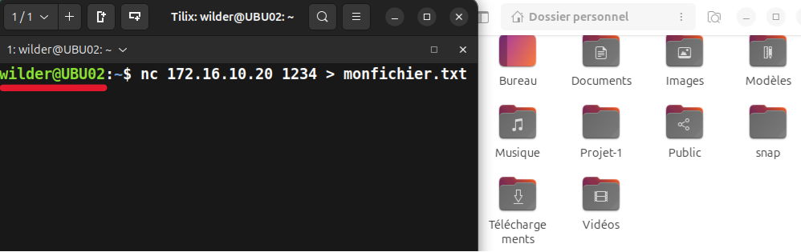|
| ---------------------------------------------------------- |
|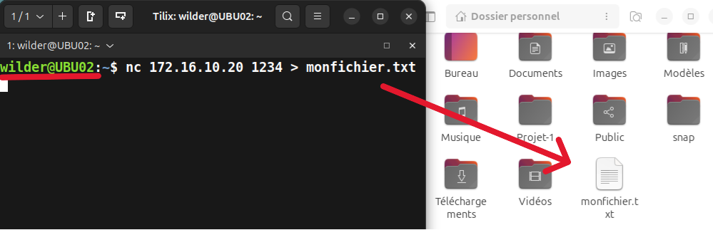|

* La commande `nc 172.16.10.XXX 1234 > fichier_recu.txt` reçoit le fichier depuis le port ouvert.
* Maintenant que la connexion a été établie d'autres echange peuvent être effectué.

# 2. Utilisation avancée

## nmap avancé

## Utilisation de script avec nmap

Il est possible de préparer un script pour choisir son type de scan

## netact avancée

# 3. Pour les pros

## Metasploit

